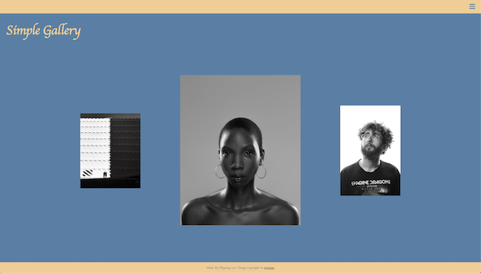
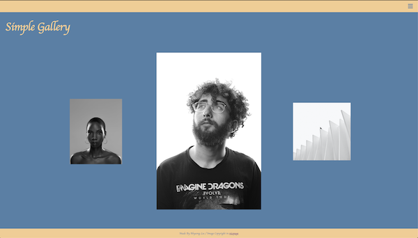
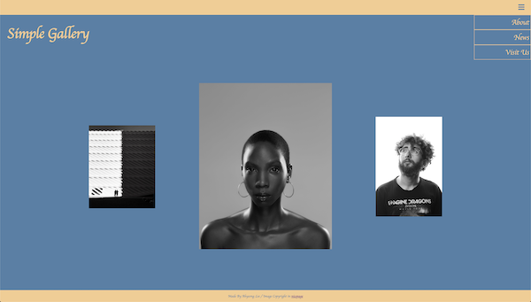
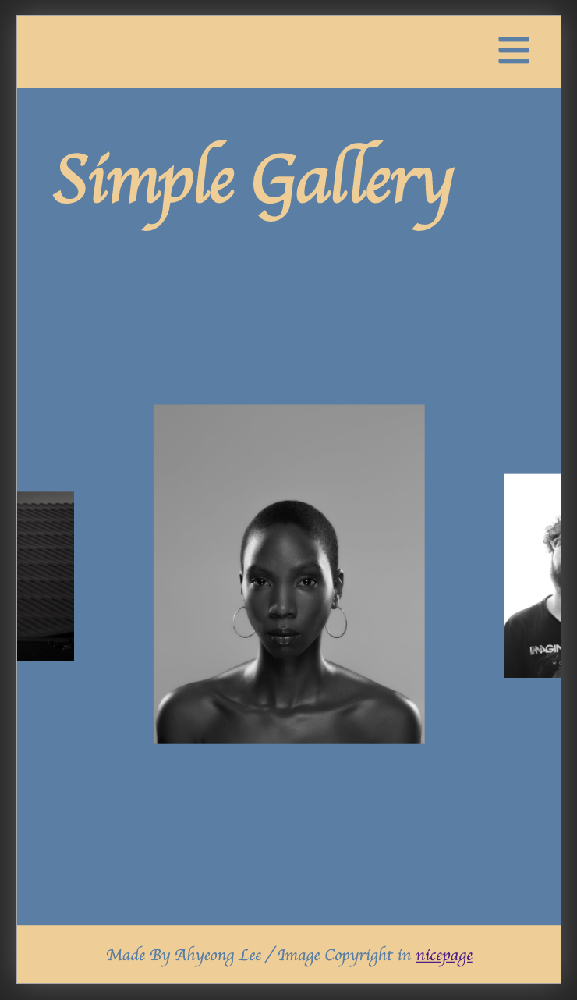
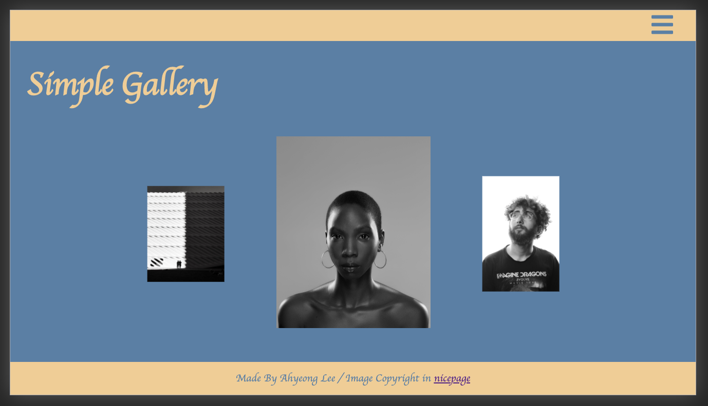
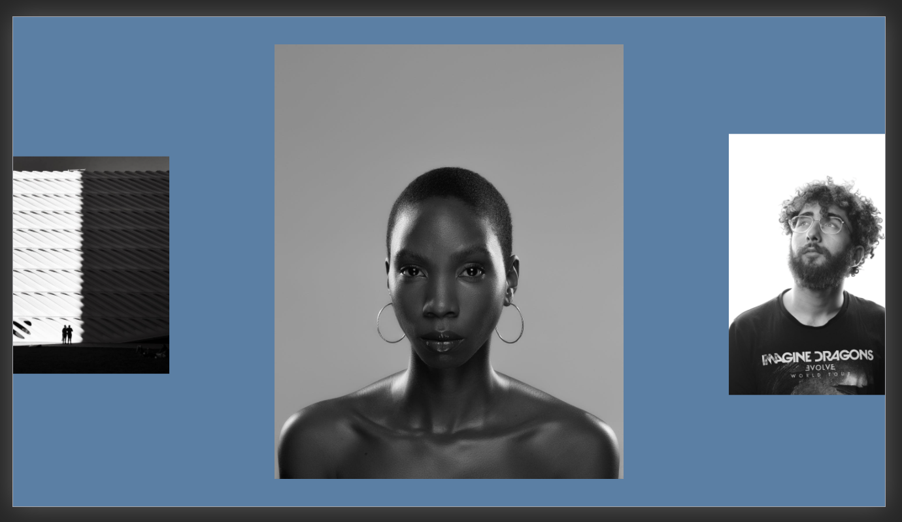

# Simple Gallery

Simple Responsive Website

  
개요

  <ol>
    <li><a href="#about-the-project">About The Project</a></li>
    <li><a href="#skills">Skills</a></li>
    <li><a href="#screen-shots">Screen Shots</a></li>
    <li><a href="#acknowledgements">Acknowledgements</a></li>
  </ol>

 

---

 

## About The Project

임의의 갤러리 홈 사이트 제작 
좌우 사진을 클릭하면서 갤러리의 사진을 볼 수 있다.

## Skills

- Vanilla JS
- HTML / CSS

## Screen Shots

- 메인 화면  
    

- 오른쪽 사진 클릭 

  사진이 전체적으로 왼쪽으로 shift 되면서 클릭된 사진이 가운데로 오게된다.  
   

- 메뉴 보기  
  

- 모바일 새로 화면   
  

- 모바일 가로 화면  
  

  모바일은 화면이 작기 때문에 내용이 화면을 넘어가게 만들었고 
  짤리는 부분은 수직으로 스크롤이 가능하다. 

   

## Acknowledgements

- Image Copyright : [nicepage](https://nicepage.com/)
